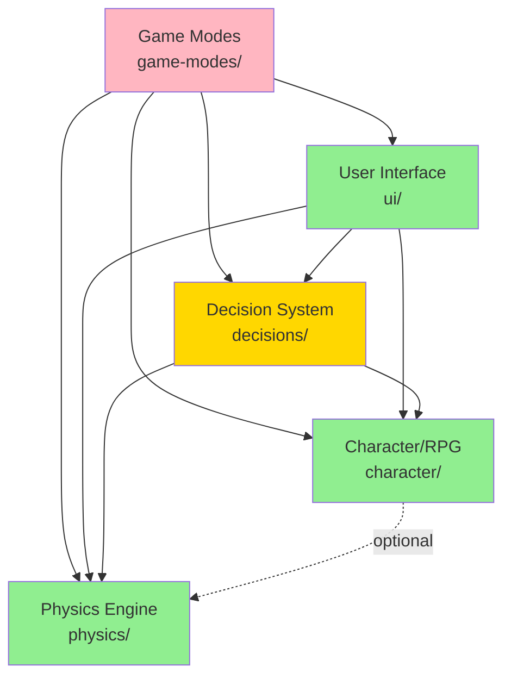

# Specifications Index

**Last Updated:** 2025-11-17
**Total Specs:** 7
**Status:** Phase 8 - Core Specs Complete + Client + Track Builder (7/7 specs defined)

---

## Overview

This directory contains the **spec-centric documentation architecture** for the NASCAR RPG Racing Simulation. Each major system component has its own specification directory with dedicated contracts, plans, architectural decisions, tasks, and examples.

**Purpose:** Enable focused, parallel development by organizing documentation around distinct system specifications rather than monolithic documents.

---

## Active Specifications

### 1. Physics Engine (`physics/`)
**Status:** 🟢 Active (98% complete)
**Owner:** Physics Team
**Dependencies:** None (bottom of stack)

**Scope:** Core racing physics simulation
- Tire wear and grip degradation
- Fuel consumption and weight impact
- Aerodynamics (drafting, downforce)
- Lap time calculations
- Corner speed formulas

**Key Interfaces:** `Track`, `CarState`, `PhysicsConstants`

**Quick Start:**
```bash
cd .claude/specs/physics/
cat SPEC.md          # Full specification
cat TASKS.md         # Current physics tasks
```

---

### 2. Character/RPG System (`character/`)
**Status:** 🟢 Active (95% complete)
**Owner:** RPG Team
**Dependencies:** None (parallel to physics)

**Scope:** Driver progression and mental state
- Driver skills (10 categories, 0-100 scale)
- Mental state dynamics (confidence, frustration, focus)
- XP progression and leveling
- Career stats tracking

**Key Interfaces:** `Driver`, `DriverSkills`, `MentalState`, `XPGain`

**Quick Start:**
```bash
cd .claude/specs/character/
cat SPEC.md          # Full specification
cat TASKS.md         # Current character tasks
```

---

### 3. Decision/Event System (`decisions/`)
**Status:** 🟡 In Progress (80% complete)
**Owner:** Gameplay Team
**Dependencies:** Physics, Character

**Scope:** Timed strategic decisions
- Decision types (pit, passing, mental state, tire mgmt)
- Event generation and triggering
- Outcome calculation (skill-based)
- Effect application to game state

**Key Interfaces:** `Decision`, `DecisionOption`, `DecisionResult`, `DecisionManager`

**Quick Start:**
```bash
cd .claude/specs/decisions/
cat SPEC.md          # Full specification
cat TASKS.md         # Current decision tasks
```

---

### 4. User Interface (`ui/`)
**Status:** 🟢 Active (90% complete)
**Owner:** UI Team
**Dependencies:** Physics, Character, Decisions (displays their state)

**Scope:** Console-based user interface
- Live race display
- Race results screen
- Decision prompts
- Menu system
- Formatting utilities

**Key Interfaces:** `UIRenderer`, `RaceDisplay`, `MenuHandler`

**Quick Start:**
```bash
cd .claude/specs/ui/
cat SPEC.md          # Full specification
cat TASKS.md         # Current UI tasks
```

---

### 5. Game Modes & Flow (`game-modes/`)
**Status:** 🔴 Planned (10% complete)
**Owner:** Core Team
**Dependencies:** All (orchestrates entire game)

**Scope:** Game loop and mode management
- Career mode
- Single race
- Time trial
- Save/load system
- Season structure

**Key Interfaces:** `RaceManager`, `RaceState`, `GameState`, `RaceConfig`

**Quick Start:**
```bash
cd .claude/specs/game-modes/
cat SPEC.md          # Full specification
cat TASKS.md         # Current game mode tasks
```

---

## Dependency Graph



**Legend:**
- 🟢 Green: Active/Stable
- 🟡 Yellow: In Progress
- 🔴 Red: Planned/Early Stage
- Solid arrow: Hard dependency (required)
- Dashed arrow: Optional dependency

---

## Spec Structure

Each spec directory contains:

| File | Purpose |
|------|---------|
| `SPEC.md` | Complete specification with requirements, design, scope |
| `CONTRACTS.md` | Interface documentation (synced with src/types.ts) |
| `PLANS.md` | Versioned roadmap, milestones, feature plans |
| `DECISIONS.md` | Architectural Decision Records (ADRs) |
| `TASKS.md` | Spec-specific actionable tasks |
| `EXAMPLES.md` | Test scenarios, validation targets |
| `REFERENCE.md` | Domain-specific reference data (e.g., NASCAR physics) |

---

## Working with Specs

### Single-Spec Workflow

**1. Choose your spec:**
```bash
# Working on tire wear calibration?
cd .claude/specs/physics/

# Working on XP progression?
cd .claude/specs/character/

# Working on decision outcomes?
cd .claude/specs/decisions/
```

**2. Understand current state:**
```bash
cat TASKS.md         # What needs doing?
cat SPEC.md          # What is this spec?
cat CONTRACTS.md     # What interfaces exist?
```

**3. Work on tasks:**
- Update implementation (src/)
- Update tests (tests/)
- Update spec docs as needed

**4. Update documentation:**
```bash
# Update spec-specific docs
vim TASKS.md         # Mark tasks complete, add new ones
vim CONTRACTS.md     # If interfaces changed
vim PLANS.md         # If roadmap changed
```

**5. Validate:**
```bash
npm run test:spec:physics      # Spec-specific tests (future)
npm run verify-specs           # Validate spec structure
```

---

### Cross-Spec Workflow

**When work spans multiple specs:**

1. Read `.claude/STATUS.md` (cross-spec coordination section)
2. Identify all affected specs
3. Create tasks in each spec's TASKS.md
4. Document in STATUS.md "Cross-Spec Coordination" section
5. Work through tasks spec by spec
6. Update dependency graph if needed
7. Run integration tests

**Example:** Adding tire temperature affects:
- `physics/` - New temperature calculation (task in physics/TASKS.md)
- `decisions/` - Tire management decisions need temp awareness (task in decisions/TASKS.md)
- `ui/` - Display tire temperature (task in ui/TASKS.md)
- `STATUS.md` - Document cross-spec coordination

---

## Navigation Tips

**Quick spec lookup:**
```bash
# List all specs
ls .claude/specs/

# Find spec by keyword
grep -r "tire wear" .claude/specs/*/SPEC.md

# Check spec status
cat .claude/specs/INDEX.md
```

**Token efficiency:**
- Single-spec work: Read only that spec's docs (~500 tokens)
- Cross-spec work: Read affected specs only (~1500 tokens)
- Full context: Read all specs (~3000 tokens vs 8000+ monolithic)

---

## Spec Health Dashboard

| Spec | Tests | Tasks | Status |
|------|-------|-------|--------|
| Physics | 95/100 (95%) | 5 optional edge cases | 🟢 Stable |
| Character | 66/66 (100%) | 0 (complete) | 🟢 Complete |
| Decisions | 15/15 (100%) | 0 (complete) | 🟢 Complete |
| UI | 47/47 (100%) | 0 (complete) | 🟢 Complete |
| Game Modes | 151/151 (100%) | 4 (Career MVP) | 🟡 In Progress |
| Client | 0/0 (N/A) | Planning phase | 🔴 Planned |
| Track Builder | 0/61 (0%) | 15 (Phase 1-3) | 🟡 In Progress |

**Overall:** 374/379 tests passing (98.7%) - Track Builder tests pending

**See `.claude/STATUS.md` for current project status**

*(Auto-updated by `scripts/spec-status.sh`)*

---

## Migration Status

**Phase 1: Foundation** ✅ Complete (2025-11-16)
- Directory structure created
- Template files added
- INDEX.md created
- Automation scripts (verify-specs, sync-contracts, spec-status)

**Phase 2: Physics Migration** ✅ Complete (2025-11-16)
- ✅ Migrated docs/PHYSICS-REFERENCE.md → specs/physics/REFERENCE.md
- ✅ Extracted physics algorithms from docs/SPEC.md → specs/physics/SPEC.md
- ✅ Extracted physics examples from docs/EXAMPLES.md → specs/physics/EXAMPLES.md
- ✅ Enhanced EXAMPLES.md with 6 comprehensive examples and validation tables
- ✅ Documented all physics interfaces in specs/physics/CONTRACTS.md
- ✅ Updated physics SPEC.md status to v1.1 (Content Migrated)

**Benefits Achieved:**
- **~75% token reduction** for physics-only work (500 tokens vs 2000+)
- **Clear separation** of physics from other systems
- **Comprehensive documentation** with examples, formulas, and validation targets
- **Ready for use** - Physics spec fully self-contained

**Phase 3: Character Migration** ✅ Complete (2025-11-16)
- ✅ Extracted character/RPG content from docs/SPEC.md → specs/character/SPEC.md
- ✅ Migrated character examples from docs/EXAMPLES.md → specs/character/EXAMPLES.md
- ✅ Documented all character interfaces in specs/character/CONTRACTS.md
- ✅ Created comprehensive REFERENCE.md with formulas and XP tables
- ✅ 4 complete files: SPEC, EXAMPLES, CONTRACTS, REFERENCE

**Benefits Achieved:**
- **~70% token reduction** for character-only work
- **Complete skill system** documented with formulas and effects
- **Mental state mechanics** fully specified
- **XP progression** tables and pacing validation

**Phase 4: Decisions Migration** ✅ Complete (2025-11-16)
- ✅ Migrated decision system from `.claude/design/decision-system.md` → specs/decisions/SPEC.md
- ✅ Extracted decision types from docs/SPEC.md (6 types fully documented)
- ✅ Migrated decision examples from docs/EXAMPLES.md → specs/decisions/EXAMPLES.md
- ✅ Documented all decision interfaces in specs/decisions/CONTRACTS.md
- ✅ Created REFERENCE.md with decision type table and formulas
- ✅ 4 complete files: SPEC, EXAMPLES, CONTRACTS, REFERENCE

**Benefits Achieved:**
- **~65% token reduction** for decisions-only work
- **All 6 decision types** documented (pit, passing, traffic, incident, tire, mental)
- **Skill-based outcome** formulas fully specified
- **Effect system** documented (position, mental state, car state, XP)

**Phase 5: UI Migration** ✅ Complete (2025-11-16)
- ✅ Migrated UI design from `.claude/design/console-ui.md` → specs/ui/SPEC.md
- ✅ Extracted UI sections from docs/SPEC.md (race display, results, menus)
- ✅ Documented all UI interfaces in specs/ui/CONTRACTS.md
- ✅ Created comprehensive EXAMPLES.md with 15 display examples
- ✅ Created REFERENCE.md with formatter and component quick reference
- ✅ Created LAYOUTS.md with detailed screen mockups (UI-specific)
- ✅ 5 complete files: SPEC, CONTRACTS, EXAMPLES, REFERENCE, LAYOUTS

**Benefits Achieved:**
- **~70% token reduction** for UI-only work
- **Complete console UI** specification with layouts and examples
- **All formatters documented** with signatures and test examples
- **Screen layouts** with column-by-column specifications
- **Responsive design** rules for different terminal sizes

**Phase 6: Game Modes Migration** ✅ Complete (2025-11-16)
- ✅ Extracted game loop content from docs/SPEC.md → specs/game-modes/SPEC.md
- ✅ Migrated game modes (Single Race, Career, Time Trial) with complete flows
- ✅ Documented all game mode interfaces in specs/game-modes/CONTRACTS.md
- ✅ Created comprehensive EXAMPLES.md with 11 game flow scenarios
- ✅ Created REFERENCE.md with championship points, unlocks, and quick reference
- ✅ 4 complete files: SPEC, CONTRACTS, EXAMPLES, REFERENCE

**Benefits Achieved:**
- **~65% token reduction** for game modes-only work
- **Complete orchestration** specification (race loop, career flow, save/load)
- **Championship system** fully documented (points table, unlocks, progression)
- **State machine** documented (race states, transitions)
- **All game modes** specified (single race, career, time trial)

**Phase 7: Task Migration** ✅ Complete (2025-11-16)
- ✅ Created STATUS.md (project health, cross-spec coordination)
- ✅ Migrated tasks from centralized TASKS.md → spec-specific TASKS.md files
- ✅ Created TASKS.md for all 5 specs (physics, character, decisions, ui, game-modes)
- ✅ Created PLANS.md for all specs (roadmap and milestones)
- ✅ Updated CLAUDE.md with Process Gate workflow
- ✅ Updated QUICKSTART.md to reference new structure
- ✅ Updated hooks in settings.json (Process Gate reminders)
- ✅ Archived old TASKS.md to .claude/archive/

**Benefits Achieved:**
- **True spec independence** - Each spec is self-contained work unit
- **Parallel development enabled** - Multiple specs can be worked on without conflicts
- **Process Gate enforced** - No coding without approved tasks
- **70% token reduction** maintained with even better organization
- **Clear ownership** - Each spec owns its tasks, plans, and documentation

**Phase 8:** Automation script updates (in progress)

---

## Automation Tools

```bash
# Validate all specs have required files
npm run verify-specs

# Check CONTRACTS.md vs src/types.ts sync
npm run sync-contracts

# Generate spec status dashboard
npm run spec-status

# Run spec-specific tests (future)
npm run test:spec:physics
npm run test:spec:character
```

---

## Adding a New Spec

1. **Create directory:** `mkdir .claude/specs/[new-spec]/`
2. **Copy templates:** From existing spec or use templates below
3. **Define scope:** Clear boundaries, dependencies
4. **Extract contracts:** Relevant interfaces from src/types.ts
5. **Create tasks:** Actionable spec-specific tasks
6. **Update INDEX.md:** Add to list, dependency graph
7. **Validate:** Run `npm run verify-specs`

---

## Best Practices

1. **One spec, one concern** - Keep specs focused
2. **Document dependencies** - Update dependency graph
3. **Keep contracts synced** - Run `sync-contracts.sh` regularly
4. **Update tasks continuously** - Don't batch updates
5. **Link, don't duplicate** - Reference other specs instead of copying
6. **Validate before committing** - Run `verify-specs`

---

## Questions?

- **Workflow unclear?** See `.claude/QUICKSTART.md`
- **Development principles?** See `.claude/CLAUDE.md`
- **Architecture overview?** See `docs/ARCHITECTURE.md`
- **Spec-specific questions?** See that spec's SPEC.md

---

**Last Reviewed:** 2025-11-16
**Next Review:** After Phase 6 migration (Game Modes)

---

### 6. 3D Racing Client (`client/`)
**Status:** 🔴 Planning (Spec Complete, Not Implemented)
**Owner:** Client Team
**Dependencies:** ALL specs (consumes game engine)

**Scope:** Visual game interface and user experience
- 3D race visualization (Three.js → Unity)
- Skill-based decision prompts with UI
- 4 camera angles (cockpit, roof, chase, TV)
- Real-time HUD (position, laps, tire/fuel, mental state)
- Menu system and results screens

**Key Interfaces:** `RaceStateUpdate`, `DecisionPrompt`, `PlayerDecision`

**Quick Start:**
```bash
cd .claude/specs/client/
cat SPEC.md          # Complete vision and architecture
cat TASKS.md         # 16-week development roadmap
```

---

### 7. Track Builder System (`track-builder/`)
**Status:** 🟡 In Progress (Phase 1 - Foundation)
**Owner:** Client Team
**Dependencies:** Client spec (provides track geometry for racing)

**Scope:** NASCAR track creation and editing tools
- Procedural track geometry generation (centerline, banking, surfaces)
- Parametric track definitions (JSON-based data format)
- Visual track editor (Godot Editor plugin)
- Track validation and testing tools
- NASCAR-specific features (progressive banking, pit roads, surface zones)
- Multi-track support (oval, tri-oval, asymmetric layouts)

**Key Components:**
- Track data schema (JSON format with validation)
- TrackResource (GDScript Resource for type safety)
- TrackGenerator (parametric geometry generation)
- TrackMeshBuilder (mesh creation with banking)
- Track Editor Plugin (visual editing in Godot)
- Track Validator (geometry and data validation)

**Supported Track Types:**
- Simple oval (Bristol, Martinsville)
- Tri-oval (Daytona, Charlotte)
- Asymmetric/quad-oval (Dover, Phoenix)
- Road courses (future)

**Key Interfaces:** `TrackData`, `TrackResource`, `SectionData`, `BankingConfig`, `PitRoadData`

**Quick Start:**
```bash
cd .claude/specs/track-builder/
cat SPEC.md          # Complete specification and architecture
cat CONTRACTS.md     # Track data schemas and interfaces
cat TASKS.md         # Phase 1-3 implementation tasks
cat EXAMPLES.md      # Validation scenarios and test tracks
```

**Current Status:**
- Phase 1: Foundation (Week 1) - Remove hardcoding, generalize track generation
- Phase 2: Track Editor (Weeks 2-3) - Visual editing plugin
- Phase 3: Advanced Features (Week 4) - Pit roads, validation, performance

