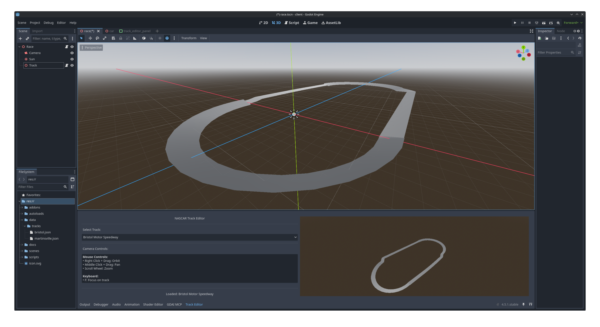
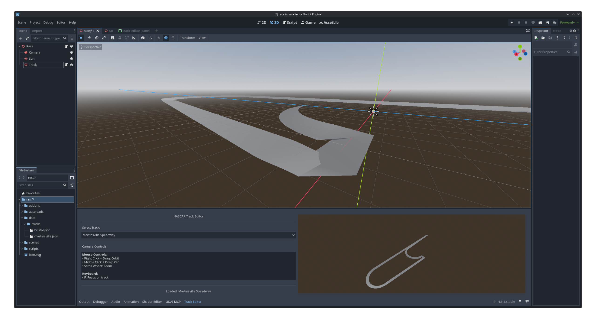

# NASCAR RPG Racing Simulation

An RPG-style NASCAR racing simulation where skill progression and mental state affect race performance. Unlike traditional racing games that require expensive peripherals and manual dexterity, this game focuses on strategic decision-making and character development.

## Core Features

- **Real Physics Simulation** - Lap times calculated from actual NASCAR racing mechanics
- **RPG Progression** - Driver skills improve through experience and XP
- **Mental State System** - Confidence, frustration, and focus dynamically affect performance
- **Strategic Decisions** - Time-pressured choices that impact race outcomes
- **No Hardware Required** - Console-based interface (with future UI options)

## Game Concept

You start as a low-skill rookie driver. As you race, your skills increase. Pass cars, and your confidence grows. Make mistakes, and frustration builds, affecting your performance. Every decision matters - from pit strategy to passing attempts to mental state management.

The simulation calculates outcomes based on:
- Driver skills (racecraft, consistency, aggression, focus, etc.)
- Mental state (confidence, frustration, focus, distraction)
- Car condition (tire wear, fuel level)
- Track characteristics (banking, length, surface)
- Real NASCAR physics (drafting, tire degradation, fuel consumption)

## Project Status

🎉 **Fully Playable Racing Game!** 🎉

**Last Updated:** 2025-11-17
**Test Pass Rate:** 414/417 tests passing (99.3%)

This project is being built following a strict methodology to ensure sustainable development:

1. ✅ **Planning Complete** - Specs, architecture, and examples documented
2. ✅ **Project Setup Complete** - TypeScript, testing framework configured
3. ✅ **Core Engine Complete**
   - ✅ Physics System (tire wear, fuel consumption, speed, lap times)
   - ✅ Character System (skills, mental state, XP progression)
   - ✅ Race Simulation Engine (lap-by-lap racing with position tracking)
4. ✅ **Decision System Complete** - Strategic choices during races
   - ✅ 5 decision types (pit strategy, passing, mental state, tire management, traffic)
   - ✅ Skill-based outcomes (not random!)
   - ✅ Effects applied to race state (position, mental state, car condition)
   - ✅ XP rewards for good decisions
5. ✅ **Console UI Complete** - Live race display, decision prompts, results screen

**Current Status:** Fully playable! Run `npx tsx demo-race.ts` to race 100 laps at Bristol with interactive strategic decisions.

**Features:**
- ⚡ Real physics simulation (not predetermined outcomes)
- 🧠 Skill-based decision system (driver stats affect success)
- 📊 Mental state affects performance and decisions
- 🏆 XP progression from race results and decisions
- 🎮 Interactive console UI with live updates

**Next:** Polish, additional tracks, and career mode features!

## 🏗️ 3D Track Builder (NEW!)

We've built a **visual track editor** in Godot for creating NASCAR tracks with real-world geometry!

### Phase 1 Complete: Parametric Track Generation ✅

**Bristol Motor Speedway** - The Last Great Colosseum


**Martinsville Speedway** - The Paperclip


**Features:**
- ✅ **Parametric track generation** - Real circular arcs, not approximations
- ✅ **Multi-track support** - Bristol (0.533 mi oval) and Martinsville (0.526 mi paperclip)
- ✅ **Spiral transitions** - Smooth banking changes between turns and straights
- ✅ **Research-validated dimensions** - Matches real NASCAR track specifications
- ✅ **3D preview** - Real-time rendering with camera controls
- ✅ **Low-poly optimization** - 131 points per track (performant!)
- ✅ **Closed loop geometry** - Tracks form perfect circuits

**Technical Achievements:**
- JSON-driven track data (easily add new tracks)
- Proper tangent continuation between sections
- Progressive banking (24-30° in turns, 6-10° on straights for Bristol)
- Godot EditorPlugin integration
- Parametric approach validated against NASCAR industry standards

**Next Phase:** Visual spline editor, smoothing refinements, additional tracks!

See [.claude/specs/INDEX.md](.claude/specs/INDEX.md) for the spec-centric documentation architecture, or [docs/SPEC.md](docs/SPEC.md) for the legacy monolithic design document. For development workflow, see [.claude/CLAUDE.md](.claude/CLAUDE.md).

## Quick Demo

Want to race right now? Run an interactive 100-lap race at Bristol:

```bash
npm install
npm run play
```

This demo lets you make strategic decisions during the race (pit strategy, passing attempts, tire management) and see how your choices affect the outcome!

## Documentation

### Spec-Centric Documentation (Primary)

The project uses a **spec-centric architecture** where each major system has its own focused specification:

- **[specs/INDEX.md](.claude/specs/INDEX.md)** - Navigation hub for all specs
- **[specs/physics/](.claude/specs/physics/)** - Physics engine (tire wear, fuel, lap times)
- **[specs/character/](.claude/specs/character/)** - RPG system (skills, XP, mental state)
- **[specs/decisions/](.claude/specs/decisions/)** - Decision system (pit strategy, passing)
- **[specs/ui/](.claude/specs/ui/)** - User interface (console renderer, displays)
- **[specs/game-modes/](.claude/specs/game-modes/)** - Game modes (single race, career)

**Benefits:** ~70% token reduction for focused work, parallel development, clear boundaries.

### Legacy Monolithic Documentation (Reference)

- **[SPEC.md](docs/SPEC.md)** - Original complete game design (now distributed across specs)
- **[ARCHITECTURE.md](docs/ARCHITECTURE.md)** - System-wide technical architecture
- **[EXAMPLES.md](docs/EXAMPLES.md)** - Aggregate test scenarios and NASCAR reference data

### For Claude Code Users
- **[QUICKSTART.md](.claude/QUICKSTART.md)** - Start here after /new sessions (cold start optimization)
- **[TASKS.md](.claude/TASKS.md)** - Current work, test status, next steps (living document)
- **[CLAUDE.md](.claude/CLAUDE.md)** - Development workflow and principles
- **Automated Quality:** Git hooks enforce TDD discipline (tests pass, proper commits, docs synced)

## Prerequisites

- Node.js >= 18.0.0
- npm (comes with Node.js)

## Installation

```bash
# Clone the repository
git clone <repository-url>
cd racing-simulation

# Install dependencies
npm install
```

## Development

```bash
# Run in development mode (with tsx - no build step)
npm run dev

# Run tests
npm test

# Run tests with UI
npm run test:ui

# Run tests with coverage
npm run test:coverage

# Type checking
npm run type-check

# Linting
npm run lint
npm run lint:fix
```

## Building

```bash
# Compile TypeScript to JavaScript
npm run build

# Run compiled version
npm start
```

## Project Structure

```
racing-simulation/
├── .claude/                # Claude Code project context
│   └── CLAUDE.md          # Development principles
├── docs/                  # Planning and design documents
│   ├── SPEC.md
│   ├── ARCHITECTURE.md
│   └── EXAMPLES.md
├── src/                   # Source code
│   ├── types.ts          # TypeScript interfaces (contracts)
│   ├── engine/           # Physics simulation
│   ├── character/        # Driver stats, mental state, XP
│   ├── events/           # Decision system
│   ├── data/             # Track/car/driver data (JSON)
│   └── ui/               # User interface
├── tests/                 # Test files
│   ├── unit/             # Unit tests
│   ├── integration/      # Integration tests
│   └── e2e/              # End-to-end tests
└── package.json
```

## Architecture Highlights

**Layered Design:**
- **Data Layer** - JSON files with track/car/driver specs
- **Engine Layer** - Pure physics calculations
- **Character Layer** - RPG stats and progression
- **Events Layer** - Decision system
- **Orchestration Layer** - Race loop and state management
- **UI Layer** - Presentation (swappable)

**Key Principles:**
- Contract-first development (TypeScript interfaces)
- Test-driven development (TDD)
- Separation of concerns (layers don't depend on higher layers)
- Real simulation (not predetermined outcomes)

See [ARCHITECTURE.md](docs/ARCHITECTURE.md) for details.

## Roadmap

### Phase 1: Planning & Setup ✅ Complete
- [x] Comprehensive specifications (SPEC.md, ARCHITECTURE.md, EXAMPLES.md)
- [x] TypeScript project setup
- [x] Testing framework (Vitest)
- [x] Development workflow and TDD principles

### Phase 2: Core Engine ✅ Complete (92.3%)

**Physics System** ✅ Complete
- [x] Tire wear physics (17/17 tests passing)
- [x] Fuel consumption physics (30/30 tests passing)
- [x] Speed calculation (27/34 tests passing - 79.4%)
- [x] Lap time calculation (28/39 tests passing - 71.8%)
- [ ] Aerodynamics/drafting (deferred to future extension)

**Character System** ✅ Complete
- [x] Driver class with 10 skill categories (28/28 tests)
- [x] Mental state system (27/27 tests)
- [x] XP and progression mechanics (11/11 integration tests)
- [x] Physics integration working

**Race Simulation** ✅ Complete
- [x] Race loop orchestration (21/21 integration tests)
- [x] Lap-by-lap state management
- [x] Position tracking with gap calculations
- [x] Lap completion and race results
- [ ] Event generation system (Phase 4)

### Phase 3: Console UI ✅ Complete (47 tests)
- [x] Live race display with standings table
- [x] Real-time car status (tires, fuel) with progress bars
- [x] Mental state visualization
- [x] Race results screen with XP breakdown
- [x] Driver status panel (skills, stats, mental state)
- [x] Menu/input handling system
- [x] Working demo script (demo-race.ts)

### Phase 4: Decisions & Events ✅ Complete (15 tests)
- [x] Decision system framework (DecisionManager)
- [x] Pit strategy decisions (full service vs fuel-only vs stay out)
- [x] Passing opportunity decisions (aggressive vs patient vs draft)
- [x] Mental state management decisions (calm down vs push through)
- [x] Tire management decisions (conserve vs manage vs push)
- [x] Traffic management decisions (aggressive vs patient vs alternate line)
- [x] Skill-based outcome calculation (not random!)
- [x] Decision effects applied to race state
- [x] XP rewards for decisions
- [x] Interactive decision prompts in UI
- [x] Integrated with race simulation

### Phase 5: Polish & Extensions ⏳ Next
- [x] Complete playable race with decisions ✅
- [ ] Additional NASCAR tracks (Charlotte, Daytona with realistic data)
- [ ] Enhanced AI competitor behavior
- [ ] Career mode (season progression, championship points)
- [ ] Save/load system
- [ ] Additional decision types (caution flag strategy, setup changes)

### Future Extensions
- Web-based UI
- Full NASCAR schedule (36+ races)
- Career mode with seasons
- 3D visualization / game client
- Multiplayer

**Known Issues:** Physics calibration at 79-90% (Bristol lap times ~0.5s off target, tire wear penalty slightly high). Deferred until race simulation provides more validation context.

## Contributing

This is currently a personal learning project, but suggestions and feedback are welcome via issues.

## Development Philosophy

This project follows a disciplined approach to avoid the "restart trap":

1. **Spec-first** - Design documented before implementation
2. **Contract-first** - TypeScript interfaces defined before code
3. **Test-first** - Tests written before implementation (TDD)
4. **Commit-frequently** - Small, working increments with git checkpoints
5. **Layer-separation** - Clear boundaries prevent coupling

See [.claude/CLAUDE.md](.claude/CLAUDE.md) for full development guidelines.

## License

MIT

## Acknowledgments

- NASCAR for inspiring the simulation mechanics
- The racing sim community for physics research
- Claude Code for development assistance
